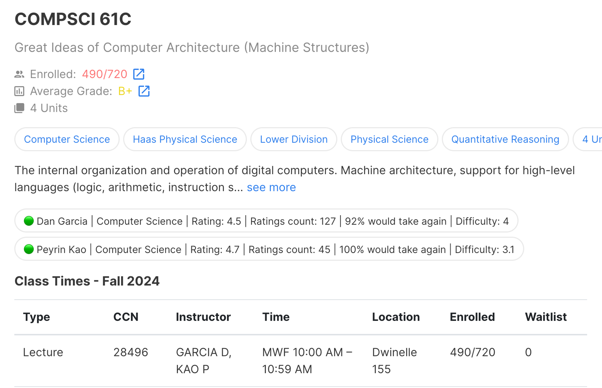

# RateMyProfessors extention for Berkeleytime
This extension enhances the Berkeleytime course catalog by adding RateMyProfessors statistics directly to the catalog page. This is meant to be as a proof of concept.
Scraping data from RateMyProfessors is against their terms of service, a production version of the extention would have significantly reduced functionalities.

# Example

## Set Up
1. Install dependencies and start local server.
2. Ensure that the extention is configured to the correct proxy host. Configuration is made by editting the proxy constant in content.js
3. Load unpacked extention to chromium based browser in developer mode.
    
## How It Works
1. DOM Monitoring: The extension uses MutationObserver to watch for updates to the course panel on the Berkeleytime catalog page.
2. Data Processing: When changes are detected, it creates a static snapshot of the DOM. All unique professor names are extracted into an array.
3. Data Fetching: For each proffessors in the array, after checking for cache and pending requests, a new request gets sent to a local server, which performs a web scraping operation on RateMyProfessors to find the most likely match. The server sends back the HTML content, which is processed by the extension.
4. UI Update: The extention checks the output for validity, format, and updates the current display by injecting buttons with rating info into the course panels.

## Chronic Issues
- Performance: The proxy workaround for fetching data is noticeably slow, taking between 5 to 10 seconds even on a strong LAN connection.
- Data Extraction Robustness: The methods employed for data extraction from both Berkeleytime and RateMyProfessors are fragile. Updates to these websites would likely break the code.

